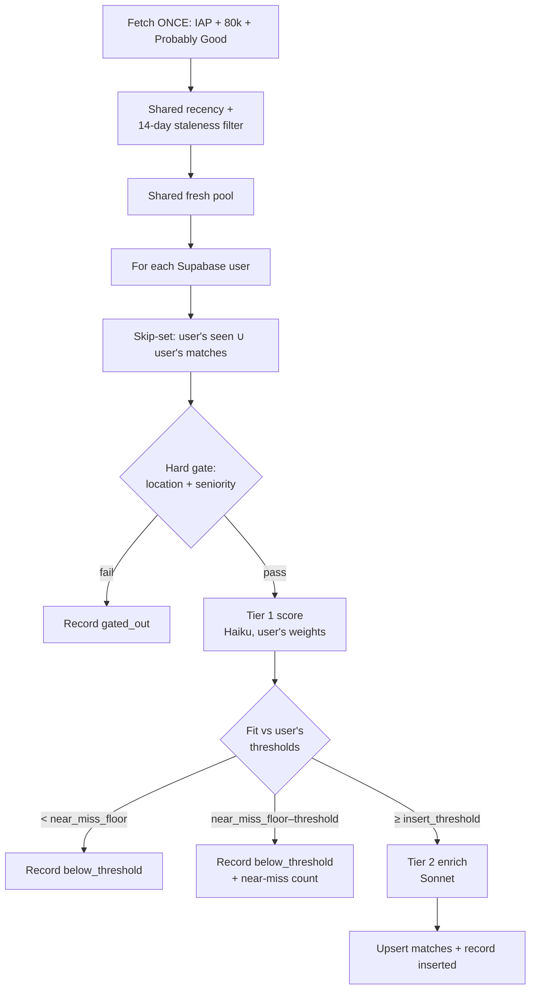

# EA Job Evaluator

Daily, serverless, **multi-user** pipeline that scrapes EA-aligned job boards once per run, scores that shared pool of postings against every registered user's own profile and weights, and writes high-fit roles into a Supabase `matches` table per user with LLM-generated reasoning and CV guidance. It runs on a schedule via GitHub Actions and requires no infrastructure beyond a repo, a Supabase project, and a handful of API keys.

The goal is narrow and personal, multiplied across users: surface the small number of genuinely well-matched roles from boards that collectively list thousands of postings, with enough reasoning attached that each surfaced role is immediately actionable rather than just a link to triage later — without re-scraping the same boards once per user.

## What it does

Every morning the pipeline pulls postings from three EA job boards **once**, applies a shared recency/staleness filter, and then loops over every user with a Supabase profile: for each user it discards anything that user has already seen or already matched, drops anything that fails that user's hard constraints, scores the remainder against that user's weights, and writes the roles that clear that user's fit threshold into `matches` — each annotated with why it fits, why it might not, and what to emphasise or de-emphasise on a CV for that specific role.



## Sources

**Three boards, three retrieval methods, scraped once per run regardless of user count.** Impact Accelerator Programme (IAP) referral opportunities live in a public Google Sheet, read via the Sheets API with a service account. The 80,000 Hours board is backed by Algolia and queried directly against its public search index. Probably Good is also Algolia-backed, but its search key is short-lived and must be fetched at runtime via a GraphQL call before querying. Each source is wrapped in its own try/except so that one board failing — a moved endpoint, a rotated key — degrades the run to the remaining sources rather than aborting it.

## Multi-user model

**Every user is a row in Supabase, not a file in the repo.** `profiles` holds identity/preferences (experience, skills, career_goals, cause_priorities, location, location_constraints, seniority_level, comp_needs, values_notes); `scoring_weights` holds the scoring config (the seven dimension weights, `location_rule`, `seniority_rule`, `insert_threshold`, `near_miss_floor`). A user is only processed if they have **both** rows — a profile with no weights can't be scored, so it's skipped (logged, not fatal).

`profiles.location_constraints`/`seniority_level` are free-form descriptive context folded into the LLM prompt. `scoring_weights.location_rule`/`seniority_rule` are the structured, gate-shaped config (`{accept_fully_remote, accept_sweden_hybrid, accept_onsite_locations}` and `{min_years_experience}`) — this is the field the hard gate actually reads, mirroring the shape the single-user `profile.yaml` used to hold under `hard_constraints`.

**Experience and skills prefer structured rows when they exist.** Two more tables, `experiences` (kind: `work` / `education` / `extracurricular` / `skill` / `software_skill` / `language`) and `experience_achievements` (bullet points nested under a work/education/extracurricular experience), are bulk-fetched once per run for every processed user and grouped in memory — not queried per user. `work`/`education`/`extracurricular` rows render into the profile's experience text (grouped under fixed headers, ordered by `sort_order`, achievements nested under their parent entry); `skill`/`software_skill`/`language` rows render into the skills text the same way. The fallback to `profiles.experience`/`profiles.skills` free text is applied **per field**: a user with structured work rows but no structured skill rows gets rendered experience text plus free-text skills, and vice versa.

**Scrape once, score per user.** The three sources are fetched a single time per run into a shared pool, then every user's loop runs gate → Tier 1 → Tier 2 against that same pool using their own weights and thresholds. This means a role can be inserted for one user, near-missed for another, and gated out entirely for a third, all from the same scrape.

## Scoring model

**A hard gate runs before any LLM call**, using the same code as before the multi-user refactor — only the constraint data now comes from `scoring_weights.location_rule`/`seniority_rule` instead of a YAML file. Two binary constraints — location and seniority — are evaluated in plain code before a posting is ever sent to a model. Unstated fields pass, biasing toward false-positives so that an ambiguous-but-promising role still gets scored. This gate rejects the large majority of postings, which is the single most important cost-control decision in the system: the expensive part of the pipeline only ever sees roles that already clear the non-negotiables, for every user.

**Two-tier LLM scoring separates cheap triage from expensive enrichment**, per user. Tier 1 uses a small, fast model (Claude Haiku) to score every gate-survivor across seven weighted dimensions for that user, returning a score and a short rationale for each. Only roles that clear that user's `insert_threshold` proceed to Tier 2, where a stronger model (Claude Sonnet) generates the organisation summary, the fit/anti-fit reasoning, and the CV emphasis guidance. Spending Sonnet tokens only on roles that will actually be written keeps per-run cost low without sacrificing quality where it matters.

**The seven dimensions are weighted per user** via `scoring_weights` (each user's weights should sum to ~1.0 — a mismatch is logged as a warning, not a hard failure). The weighted sum produces a fit score in [0, 1]; roles at or above that user's `insert_threshold` are enriched and upserted, roles between `near_miss_floor` and `insert_threshold` are logged as near-misses (not inserted), and everything else is just recorded as below-threshold. All scoring runs at temperature 0 for reproducibility.

## State: per-user seen-cache + the 14-day staleness rule

**State moved from a single committed JSON file to a Supabase `seen` table, keyed per user.** `seen` holds `(user_id, canonical_url)` unique rows with a terminal `verdict` (`gated_out` / `below_threshold` / `inserted`), `fit_score`, and `first_seen`. At the start of each user's loop, that user's `seen` rows are read once and unioned with their existing `matches` URLs to form the skip-set applied before the gate. Every terminal verdict for that user is upserted back — `first_seen` is preserved across updates (only set the first time a URL is recorded for that user), matching the old JSON cache's semantics exactly. **Parse failures are never recorded** — a transient malformed LLM response is retried next run, not permanently blacklisted.

**The 14-day staleness rule exists because some postings (mainly IAP rows) have neither a `deadline` nor a `posted_at` date** — there's no natural signal for "this is old, stop looking at it." The recency filter normally exempts these entirely, which would let a persistently-unresolved posting (e.g. one that keeps hitting Tier 1/2 parse failures, which are deliberately never cached) get re-evaluated by every user, every day, forever. To bound that cost:

- The recency filter runs **once**, shared, before the per-user loop — so it needs a signal that isn't scoped to any single user.
- It uses the **earliest `first_seen` across every user** for that posting's canonical URL (`seen_store.fetch_global_first_seen` — one query over the whole `seen` table, reduced to a per-URL minimum in Python).
- If nobody has ever seen the posting, it's fresh and kept. Once that earliest sighting is more than 14 days old, the posting is dropped from the shared pool entirely — for every user — on the theory that if it hasn't resolved for anyone in two weeks, it isn't worth continuing to spend LLM calls re-evaluating.
- This is orthogonal to a user's ordinary skip-set: once *any* terminal verdict is recorded for a user, their own skip-set filters that URL out permanently regardless of this 14-day window. The window only matters for postings that keep failing to resolve for anyone.

## Output: Supabase `matches`, not Notion

**`matches` writes are upsert-only on job fields + model output, never on user-owned columns.** The `MatchRow` schema that `matches_store.upsert_match` writes has no `status`, `user_notes`, or `discarded` fields — those columns are owned by whatever app the user tracks applications in, and it's structurally impossible for the pipeline to touch them, not just a matter of code discipline. In practice a URL is never re-upserted for a user anyway, because their skip-set (seen ∪ existing matches) filters it out before scoring runs again — this preserves any user-edited tracking status across runs.

Each match row includes the job fields (title, org, url, canonical_url, location, seniority, comp, deadline, source, cause_area) and the model output (fit_score, per-dimension `dimension_scores` as jsonb, why_fits, why_not_fits, emphasize_in_cv, deemphasize, org_summary, date_found). Upsert key is `(user_id, canonical_url)`. `matches` also has user-owned columns (`status`, `user_notes`, `discarded`) that the pipeline never writes — `MatchRow` has no fields for them, so it's structural, not just discipline.

## Deployment

**GitHub Actions on a daily cron.** The workflow runs at 06:00 UTC (avoiding the midnight-UTC high-load window) and is also manually triggerable via `workflow_dispatch`, which accepts a `dry_run` boolean, an optional `limit` (a single global cap on the shared postings pool, applied once before the per-user loop — not per user), and an optional `only_user_id` for a one-off single-user run. There is no cache-commit step and no `contents: write` permission requirement any more: all state lives in Supabase.

**`only_user_id` scopes a run to one user** instead of every registered user (still scrapes all sources — only which users get scored is scoped) and, when set and not a dry run, writes `running` → `complete`/`failed` status (with `completed_at` on completion) to a `search_quota` table keyed on `user_id`. Zero matches written is still a `complete` run; any exception — including "no profile/weights row found for that user" — lands on `failed` and re-raises. The daily multi-user cron (`only_user_id` unset) never touches `search_quota` at all, and dry runs never write to it either.

`--dry-run` still reads `profiles`/`scoring_weights`/`seen`/`matches` from Supabase (it needs real user context to build accurate skip-sets) but skips the `seen`/`matches` writes and logs what it would have written instead. This means `SUPABASE_URL`/`SUPABASE_SERVICE_ROLE_KEY` are required even for dry runs, unlike the old Notion-based dry run which needed no token at all.

Concurrency is configured with `cancel-in-progress: false`: a second trigger queues behind the first rather than cancelling it mid-run. Runtime config and credentials are injected from repository secrets; the Google service-account credential is supplied as inline JSON (the loader accepts either a file path or a JSON blob).

## Repository layout

```
src/
  schemas.py          Pydantic models for postings, scores, users, matches, run logs
  gate.py             Hard location/seniority gate (unchanged — takes a profile dict)
  scoring.py          Tier 1 (Haiku) dimension scoring (unchanged — takes profile+rubric dicts)
  enrich.py           Tier 2 (Sonnet) enrichment for high-fit roles (unchanged)
  dedup.py            URL canonicalisation
  supabase_client.py  get_client() from SUPABASE_URL / SUPABASE_SERVICE_ROLE_KEY
  user_store.py       fetch_users(): reads profiles + scoring_weights, builds the dicts gate/scoring/enrich expect
  seen_store.py       Per-user seen-cache backed by Supabase `seen` (+ the global first-seen lookup for staleness)
  matches_store.py    Upsert-only Supabase `matches` integration (never touches user-owned columns)
  quota_store.py      set_status() for one-off single-user runs, backed by Supabase `search_quota`
  pipeline.py         Orchestration: fetch users → scrape once → shared filter → per-user loop
  smoke_llm.py        Manual end-to-end smoke test (Tier 1 + Tier 2 for the first Supabase user, no writes)
  sources/
    iap.py            Google Sheet via Sheets API
    eightyk.py        80,000 Hours via Algolia
    probablygood.py   Probably Good via Algolia + GraphQL key fetch
tests/                Unit tests, incl. a FakeSupabaseClient for store/pipeline tests
SPEC.md               Original design specification
.github/workflows/daily.yml
```

Per-user profile and rubric are Supabase rows built into the same in-memory dict shapes `gate.py`/`scoring.py`/`enrich.py` always expected — those three modules didn't change in this refactor, only what feeds them did.

## Configuration

Credentials and config are read from the environment (a local `.env` for development, repository secrets in CI). The required values: the Anthropic API key; the Supabase URL and service-role key (bypasses RLS — server-side use only); the Algolia app ID, search key, and index for the 80,000 Hours board; the IAP sheet ID and tab; and the Google service-account JSON. Model identifiers and the recency window have sensible code defaults and only need to be set to override them.

Dependencies are pinned to exact versions. This was not premature caution: a loose `>=` pin silently pulled a new major version of a dependency mid-build with a breaking API change that only surfaced at runtime. Pinning exact versions makes the CI environment reproduce what works locally.

## Known limitations

**Source retrieval is capped at the most recent ~1000 postings per Algolia-backed board.** This is a search-tier limit on the Algolia query endpoint; the bulk-retrieval (`browse`) endpoint is not authorised on the public keys. It is acceptable because the pipeline targets newly-posted roles and dedupes against history, so the unreachable tail is almost entirely older roles — but it does mean a very large board is not exhaustively ingested.

**Per-user rule changes do not retroactively re-evaluate already-seen roles for that user.** Because `seen` is keyed on `(user_id, canonical_url)` and records a terminal verdict, a role recorded as `below_threshold` under one set of weights will be skipped on future runs for that user even after their weights change. To re-score the existing corpus under new rules for a user, delete their rows from `seen` and let the next run re-seed. This is a deliberate trade: the cache buys daily cost savings at the price of not automatically reflecting weight edits.

**`seniority_rule` (min years experience) is not currently enforced by the gate.** The hard-gate seniority check is a keyword scan (junior/entry/intern/etc.) independent of any numeric threshold — this was true before the multi-user refactor too. `seniority_rule` is threaded through per user for LLM context and future use, but changing it today won't change gate pass/fail behavior.

**Scoring is calibrated against real data after deployment, not before.** Thresholds and weights were deliberately not over-tuned on a handful of pre-launch examples. The near-miss band exists partly to make calibration observable per user. Compensation scoring in particular is sensitive to a known issue — a posting with no stated salary should be treated as missing information (neutral), not as evidence of inadequate pay, or the dimension degrades into a "did they publish a salary" detector.

## Testing

The suite covers the pure logic — gate decisions, dimension weighting, URL canonicalisation, per-user seen-cache upsert/preserve-first-seen behaviour, the matches upsert column allowlist, profile/rubric building from Supabase rows, and a multi-user pipeline integration test (different thresholds on the same shared posting, an existing match skipped for one user but not another, the 14-day staleness cutoff) — all against a lightweight in-memory `FakeSupabaseClient`, no real network or database. Run with `python -m pytest tests/`.
