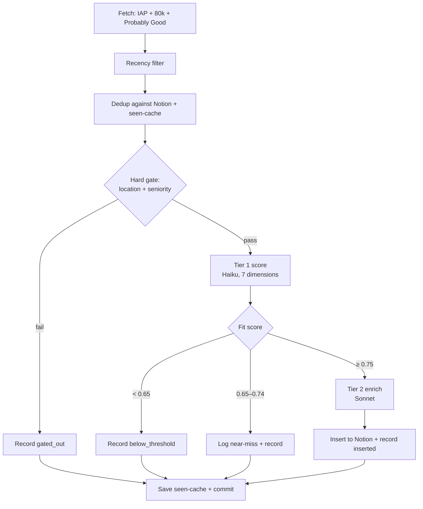

# EA Job Evaluator

Daily, serverless pipeline that scrapes EA-aligned job boards, scores new roles against a version-controlled personal profile, and inserts high-fit roles into a Notion tracker with LLM-generated reasoning and CV guidance. It runs on a schedule via GitHub Actions and requires no infrastructure beyond a repo and a handful of API keys.

The goal is narrow and personal: surface the small number of genuinely well-matched roles from boards that collectively list thousands of postings, with enough reasoning attached that each surfaced role is immediately actionable rather than just a link to triage later.

## What it does

Every morning the pipeline pulls postings from three EA job boards, discards anything it has already seen or that fails a hard constraint, scores the remainder against a personal profile, and writes the roles that clear a fit threshold into Notion — each annotated with why it fits, why it might not, and what to emphasise or de-emphasise on a CV for that specific role.



## Sources

**Three boards, three retrieval methods.** Impact Accelerator Programme (IAP) referral opportunities live in a public Google Sheet, read via the Sheets API with a service account. The 80,000 Hours board is backed by Algolia and queried directly against its public search index. Probably Good is also Algolia-backed, but its search key is short-lived and must be fetched at runtime via a GraphQL call before querying. Each source is wrapped in its own try/except so that one board failing — a moved endpoint, a rotated key — degrades the run to the remaining sources rather than aborting it.

## Scoring model

**A hard gate runs before any LLM call.** Two binary constraints — location and seniority — are evaluated in plain code before a posting is ever sent to a model. Location passes for fully-remote, Sweden-hybrid, or Sundsvall-onsite roles and fails for onsite/relocation elsewhere; seniority fails on explicit junior/entry/intern signals. Unstated fields pass, biasing toward false-positives so that an ambiguous-but-promising role still gets scored. This gate rejects the large majority of postings (typically ~85%), which is the single most important cost-control decision in the system: the expensive part of the pipeline only ever sees roles that already clear the non-negotiables.

**Two-tier LLM scoring separates cheap triage from expensive enrichment.** Tier 1 uses a small, fast model (Claude Haiku) to score every gate-survivor across seven weighted dimensions, returning a score and a short rationale for each. Only roles that clear the insert threshold proceed to Tier 2, where a stronger model (Claude Sonnet) generates the organisation summary, the fit/anti-fit reasoning, and the CV emphasis guidance. Spending Sonnet tokens only on the roles that will actually be inserted keeps per-run cost low without sacrificing quality where it matters.

**The seven dimensions and their weights** are: cause/mission fit (0.25), role/function fit (0.25), location compatibility (0.15), seniority match (0.10), compensation adequacy (0.10), values alignment (0.10), and skill growth (0.05). The weighted sum produces a fit score in [0, 1]. Roles at or above 0.75 are inserted; roles in the 0.65–0.74 near-miss band are logged with full reasoning (useful for calibration and for catching roles the threshold narrowly excludes) but not inserted. Weights sum to 1.0, guarded by a test.

All scoring runs at temperature 0 for reproducibility.

## State and idempotency

**Notion writes are insert-only.** The pipeline only ever creates new rows. If a role's URL already exists in Notion, the run skips it entirely — no field overwrite, no status reset. Once a role is moved to Draft or Applied, a later run that re-encounters the same posting leaves it untouched. Notion is treated as the durable source of truth for application state, and the pipeline is deliberately forbidden from clobbering manual edits.

**A persisted seen-cache prevents re-scoring roles that won't be inserted.** Without it, every sub-threshold and gated-out role would be re-scored on every run — a recurring daily token cost on roles already judged. The cache (`state/seen.json`) records a terminal verdict for each processed posting: `gated_out`, `below_threshold`, or `inserted`. On each run the skip-set is the union of Notion's existing URLs and the cache's recorded URLs, applied before the gate. The cache is keyed on a canonicalised URL, reusing the exact canonicalisation from the dedup module so that the cache and Notion agree on what counts as the same posting.

Parse failures are deliberately **not** cached: a transient malformed LLM response should be retried on the next run, not permanently blacklisted. Writes are atomic (temp file plus `os.replace`) so an interrupted run cannot leave a truncated cache. Entries older than 180 days are pruned. In dry-run mode the cache is read (to skip) but never written, so dry runs can be repeated freely without advancing state.

## Deployment

**GitHub Actions on a daily cron, with the cache committed back to the repo.** The workflow runs at 06:00 UTC (avoiding the midnight-UTC high-load window) and is also manually triggerable via `workflow_dispatch`, which accepts a `dry_run` boolean and an optional `limit` for cheap capped runs. After a non-dry run, the updated `state/seen.json` is committed back to the repo with `[skip ci]` so that the next run inherits the seeded state. This requires `contents: write` permission and the repository's workflow token set to read/write.

Concurrency is configured with `cancel-in-progress: false`: a second trigger queues behind the first rather than cancelling it, because cancelling mid-run would lose the cache commit even though the file write itself is atomic. Runtime config and credentials are injected from repository secrets; the Google service-account credential is supplied as inline JSON (the loader accepts either a file path or a JSON blob).

## Repository layout

```
src/
  schemas.py        Pydantic models for postings, scores, run logs
  gate.py           Hard location/seniority gate
  scoring.py        Tier 1 (Haiku) dimension scoring
  enrich.py         Tier 2 (Sonnet) enrichment for high-fit roles
  dedup.py          URL canonicalisation
  seen_cache.py     Persisted terminal-verdict cache
  notion_client.py  Notion read/insert (data-source API)
  pipeline.py       Orchestration, recency filter, run log
  smoke_llm.py      Manual end-to-end smoke test (Tier 1 + Tier 2, no Notion write)
  sources/
    iap.py          Google Sheet via Sheets API
    eightyk.py      80,000 Hours via Algolia
    probablygood.py Probably Good via Algolia + GraphQL key fetch
tests/              Unit tests
profile.yaml        Personal profile (the scoring target)
rubric.yaml         Dimension definitions and weights
SPEC.md             Original design specification
state/seen.json     Persisted cache (committed)
.github/workflows/daily.yml
```

Profile and rubric are version-controlled YAML, so changing what the pipeline optimises for is a reviewable diff rather than a code change.

## Configuration

Credentials and config are read from the environment (a local `.env` for development, repository secrets in CI). The required values: the Anthropic API key; the Notion integration token and database ID; the Algolia app ID, search key, and index for the 80,000 Hours board; the IAP sheet ID and tab; and the Google service-account JSON. Model identifiers and the recency window have sensible code defaults and only need to be set to override them.

Dependencies are pinned to exact versions. This was not premature caution: a loose `>=` pin silently pulled a new major version of the Notion SDK mid-build, which had reorganised its database endpoints into a separate "data source" concept with different IDs — a breaking change that only surfaced at runtime. Pinning exact versions makes the CI environment reproduce what works locally.

## Known limitations

**Source retrieval is capped at the most recent ~1000 postings per Algolia-backed board.** This is a search-tier limit on the Algolia query endpoint; the bulk-retrieval (`browse`) endpoint is not authorised on the public keys. It is acceptable because the pipeline targets newly-posted roles and dedupes against history, so the unreachable tail is almost entirely older roles — but it does mean a very large board is not exhaustively ingested.

**Rule changes do not retroactively re-evaluate already-seen roles.** Because the cache is keyed on URL and records a terminal verdict, a role recorded as `below_threshold` under one set of weights will be skipped on future runs even after the rubric changes. To re-score the existing corpus under new rules, delete `state/seen.json` and let the next run re-seed. This is a deliberate trade: the cache buys daily cost savings at the price of not automatically reflecting rubric edits.

**The first seeding run is slow; steady-state runs are fast.** A single uncapped run over a fresh cache scores every gate-survivor one at a time and can exceed the Actions timeout. The current approach is to seed the backlog with a few capped runs (each commits its slice, so progress is crash-safe), after which daily runs only see genuinely new postings and finish in a few minutes. The proper long-term fix would be periodic incremental cache saves so that a single long run is interruption-safe.

**Scoring is calibrated against real data after deployment, not before.** Thresholds and weights were deliberately not over-tuned on a handful of pre-launch examples. The near-miss band exists partly to make calibration observable: watching which roles cluster just below 0.75 over a week of real output is a better signal for tuning than guessing up front. Compensation scoring in particular is sensitive to a known issue — a posting with no stated salary should be treated as missing information (neutral), not as evidence of inadequate pay, or the dimension degrades into a "did they publish a salary" detector.

## Testing

The suite covers the pure logic — gate decisions, dimension weighting, URL canonicalisation, cache hit/miss and round-trips, prune behaviour, and corrupt-file tolerance — with IO confined to the load/save boundary so the rest can be tested in-memory. Run with `python3 -m pytest`.
