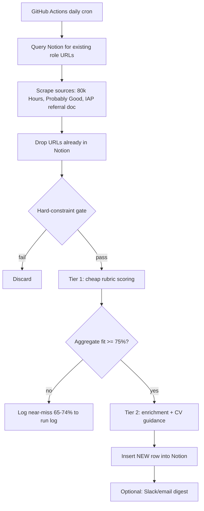

# EA Job-Fit Evaluator — Build Brief

A daily, serverless pipeline that scrapes EA-aligned job boards, scores new roles against a
version-controlled personal profile, and writes high-fit roles into a Notion application tracker
with reasoning and CV guidance.

This document is the **build contract**. Scaffold against it before wiring real APIs. Get the
reliability skeleton (schemas, dedup, validation, logging) working on stub data first, then fill in
integrations.

---

## 1. Architecture



Key principle: **the pipeline only ever INSERTS new rows. It must never read, modify, or overwrite
an existing Notion row.** See §6.

---

## 2. Profile-as-code

The profile lives in the repo as `profile.yaml` — version-controlled, read at runtime with no API
call. Edit freely; every change is a git diff. Below is a starter populated from real background —
**review and adjust before first run.**

```yaml
identity:
  name: Karl-Johan
  location: Sundsvall, Sweden
  current_role: Associate Director, Data & Insights (Etraveli Group)

hard_constraints:
  location:
    # PASS if any of these hold; otherwise FAIL
    accept_fully_remote: true            # remote roles workable from Sweden timezone
    accept_sweden_hybrid: true           # hybrid where the office is in Sweden
    accept_onsite_locations: [Sundsvall]
    # FAIL: on-site/hybrid requiring presence outside Sweden, or relocation outside Sweden
    # When seniority/location is simply UNSTATED, do NOT hard-fail — pass to soft scoring.
  seniority:
    min_years_experience: 5
    # FAIL: roles explicitly entry-level, junior, graduate, internship, or requiring <5 yrs.
    # When unstated, do NOT hard-fail.

experience_inventory:
  # Used by Tier 2 to decide what to emphasize vs de-emphasize per role.
  core_strengths:
    - Built Evidensia's BI function from scratch; grew team 1 -> 7 over ~5 years
    - Led multi-country PMS rollout across Nordic markets (Evidensia)
    - Managing 4 analytics teams across Sweden, India and Greece (Etraveli)
    - Owner of CRM system and automations, improving customer club membership LTV +10p.p. over 1 year (Evidensia)
    - Developed and deployed 6-month volume recovery strategy generating +4p.p. incremental revenue YoY (Evidensia)
    - Business Controller and steering comittee member for 2bSEK IT development portfolio (Scandinavian Airlines)
    - Stakeholder management and analytics leadership
    - Breaking down complex problems into addressable datapoints and levers
  technical:
    sql: strong
    power_bi: strong
    qlik_sense: working
    excel: advanced
    python: working
    ms_office: advanced
    power_automate: strong
    power_apps: working
    databricks: basic
  domain:
    - Data leadership
    - Operational management
    - Operations analytics
    - Controlling / FP&A (earlier career)
  earlier_background:
    - IT portfolio management (SAS)
    - Management consulting
  gaps_to_acknowledge:
    - Hands-on AI/automation building (actively closing via these projects)
    - Fundraising-domain analytics depth

values:
  cause_priorities: [global health and development, EA-aligned impact]
  signals: [GWWC pledge, HIP IAP completed, effective giving advocacy]
  dream_orgs: [GiveDirectly]

preferences:
  comp:
    # Pension replicability is a real decision factor (EOR employers may not replicate
    # Swedish tjänstepension). Flag roles where this is unclear.
    note: flag occupational-pension (tjänstepension) replicability when comp is discussed
  timezone: prefer EU-overlap; flag (do not hard-fail) roles requiring US-only hours
```

---

## 3. Scoring rubric

### Hard gates (binary, evaluated before any LLM call)
| Gate | Pass condition | Fail condition |
|---|---|---|
| Location | Fully remote, Sweden hybrid, or Sundsvall on-site | On-site/hybrid outside Sweden, or relocation outside Sweden required |
| Seniority | Mid-level, ~5+ yrs relevant experience | Explicitly entry/junior/graduate/intern or <5 yrs required |

Rule: **when a field is unstated, do not fail — pass it through to soft scoring.** Bias toward
false-positives at the gate; the soft layer and your review catch the rest.

### Soft dimensions (each 0–1 with a one-line rationale; weighted sum = fit %)
| Dimension | Weight |
|---|---|
| Cause-area / mission fit | 0.25 |
| Role-function fit (data / M&E / analytics / BI) | 0.25 |
| Location / remote compatibility | 0.15 |
| Seniority match | 0.10 |
| Comp adequacy (incl. pension replicability) | 0.10 |
| Values / org-culture alignment | 0.10 |
| Skill-growth relevance | 0.05 |

Threshold for insertion: **aggregate ≥ 0.75.** Store every per-dimension score as its own Notion
property so weights can be recalibrated later from real output.

---

## 4. Sources

| Source | Access strategy |
|---|---|
| 80,000 Hours job board | First inspect Network tab for a JSON endpoint behind the filtered UI; use it if present. Fall back to HTML + LLM-as-parser. Respect robots.txt; polite request volume. |
| Probably Good job board | Same approach — JSON endpoint first, HTML + LLM-parser fallback. |
| IAP referral Google Doc | Share the doc with a Google **service account**; read via Docs/Drive API using a key stored as a secret. |

Use Claude as the **parser** for HTML sources: feed rendered page text, extract structured postings
to a schema. This survives layout changes that would break CSS selectors.

---

## 5. Two-tier LLM flow (cost-aware)

1. **Tier 1 — gate scoring.** For roles surviving the hard gate, score the 7 soft dimensions.
   Structured JSON only, low temperature, pinned model. Cheap; runs on all survivors.
2. **Tier 2 — enrichment.** Only for roles ≥ 0.75. Generate:
   - Organization summary (2–3 sentences)
   - Why it fits (grounded in `experience_inventory` + `values`)
   - Why it might not fit
   - **Emphasize in CV:** strengths/experiences/values to foreground for this role
   - **De-emphasize:** experiences to gloss over as irrelevant here

Tier 2 reads the full profile so its CV guidance is role-specific, not generic.

---

## 6. Notion schema & the status-preservation rule

Properties:
- `Role` (title), `Org` (text), `Org summary` (text)
- `Source` (select), `URL` (url), `Date found` (date), `Deadline` (date), `Comp` (text)
- `Fit score` (number) + one number property per rubric dimension
- `Why it fits` (text), `Why it might not fit` (text)
- `Emphasize in CV` (text), `De-emphasize` (text)
- `Status` (select): **Proposed → Draft → Applied → Interview → Declined / Accepted**

**Critical reliability property:** the automation INSERTS only. If a role's URL already exists in
Notion, the pipeline skips it entirely — no field overwrite, no status reset. Once you move a role
to Draft/Applied, a later run re-encountering that posting must leave it untouched. This guarantee
goes in the README.

---

## 7. Dedup / state

- **Notion is the single source of truth for "seen."** At run start, query all existing role URLs;
  filter scraped postings against that set. No separate seen-file (avoids drift, and it's what
  enforces the status-preservation rule).
- Canonicalize the dedup key: normalize the URL (strip tracking/query params) or hash `org+title`
  so re-posts and param variants don't slip through as duplicates.

---

## 8. Calibration & observability

- Insert only ≥ 0.75, but **log near-misses (0.65–0.74) with their per-dimension scores to the run
  log.** After a week or two you'll see whether the threshold is silently rejecting good roles, and
  retune weights or threshold from real evidence.
- Log every run: counts (scraped / new / gated-out / scored / inserted), per-source success, and any
  parse failures.

---

## 9. Deployment

- **GitHub Actions**, daily cron. No server.
- Secrets: `ANTHROPIC_API_KEY`, `NOTION_TOKEN`, `NOTION_DB_ID`, `GOOGLE_SERVICE_ACCOUNT_JSON`.
- `profile.yaml` and the rubric weights live in the repo.

---

## 10. Reliability requirements (non-negotiable)

- A **pydantic schema** for every LLM output (Tier 1 scores, Tier 2 enrichment); retry once on parse
  failure, then log-and-skip the offending role rather than crashing the run.
- Idempotency: re-running the same day produces no duplicate rows and no modified rows.
- Pinned model string + low temperature for scoring; record both in the run log.
- Graceful per-source failure: if one source errors, the others still complete.
- Unit tests on: hard-gate logic, dedup/canonicalization, weighted-sum scoring, schema validation.

---

## 11. Suggested repo structure

```
ea-job-evaluator/
  README.md                 # overview, architecture diagram, setup, design decisions
  SPEC.md                   # this file
  profile.yaml              # profile-as-code (edit me)
  rubric.yaml               # weights + threshold (edit me)
  .env.example
  src/
    sources/                # one module per source; all return List[RawPosting]
    gate.py                 # hard-constraint logic
    scoring.py              # tier-1 rubric scoring
    enrich.py               # tier-2 enrichment + CV guidance
    notion_client.py        # query-existing + insert-only
    schemas.py              # pydantic models
    pipeline.py             # orchestration
  tests/
  .github/workflows/daily.yml
```

---

## 12. Build order for Claude Code

1. Scaffold structure, `schemas.py`, `profile.yaml`/`rubric.yaml`, `.env.example`.
2. Build `gate.py`, `scoring.py`, dedup, and the insert-only `notion_client.py` against **stub
   postings** — get idempotency and validation green in tests before any real API.
3. Wire one source end-to-end (start with the IAP Google Doc — smallest, most structured).
4. Add the other two sources (JSON endpoint first, HTML+LLM-parser fallback).
5. Add Tier 2 enrichment.
6. Add the Actions workflow + near-miss logging.

---

## 13. Out of scope (future)

- Auto-drafting tailored CVs/cover letters from the emphasize/de-emphasize fields.
- Webhook/real-time triggering.
- A second reviewer pass or feedback loop to auto-tune weights.
